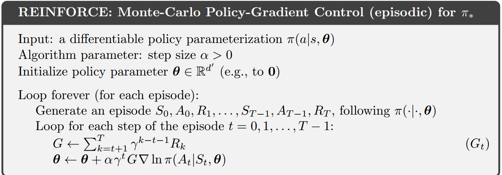

# REINFORCE

Naive implementation of Monte-Carlo Policy-Gradient Control with the help of SGD optimizer. CartPole-v0 has been used here as the environment.

The algorithm is given below.

There is one trick though. The return, G, is normalized. This helps the algorithm to have numerical stability.

